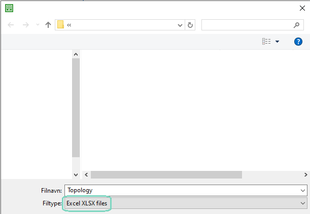

# Complete initial startup guide

<br>

## Step 1 - Get *Topology* report
    
- Open ETS and navigate to the *Reports* panel
- Choose *Export* and export as *XLSX* like shown here:




## Step 2 - Collect and format KNX addresses

- Open the exported excel file.

**Note:** 
        
    Because of the way ETS writes values to the Excel file,
    it's easier to write a Office Script to collect and format the addresses that way.
    This guide will show how to do this.


### Creating the Office Script.

<br>

- Navigate to the *Automate* panel in Excel like shown here:

<br>


<br>

**Note:**

    If you don't have this panel, google how to get it.

<br>

- Select *New Script* like shown here:

<br>


<br>

- Use this code snippet:

<br>

``` typescript

// Enter the first row containing a KNX address, optionally enter an area if you only want a certain area.
function main(workbook: ExcelScript.Workbook, startRow : number, area?: number) {
    const sheet = workbook.getActiveWorksheet();
    const usedRange = sheet.getUsedRange();
    const rowCount = usedRange.getRowCount();

    // Excel rows/columns are 0-indexed
    const addressRange = sheet.getRangeByIndexes(startRow - 1, 0, rowCount, 10); // Normally there aren't any KNX Addresses past column K i.e column 10

    const addressSet : Set<string> = new Set();

    addressRange.getValues().forEach((row, i) => {
        const adrRegex = new RegExp(/\d\.\d\.\d/);

        const test = row.find(value => adrRegex.test(String(value))) ?? null;
        const address = test != null ? String(String(test).match(adrRegex)) : null;

        if (area != null) {

            if (address != null && Number(address.charAt(0)) == area) {
                addressSet.add (`="'${address}',"`);
            }

        } else if (address != null) {

            addressSet.add(`="'${address}',"`);

        }

    });

    const addresses = Array.from(addressSet.keys()).map(address => [address]);

    addresses[addresses.length - 1][0] = addresses[addresses.length - 1][0].replace(",", "");

    const worksheetNames = workbook.getWorksheets().map(sheet => sheet.getName());
    const resultSheetArray = worksheetNames.filter(name => name.includes("Result"));

    var name : string;

    if (resultSheetArray.length == 0){
        name = "Result 1";
    } else {
        let latestResultName = resultSheetArray.sort((a, b) => {
            const aIndex = Number(a.charAt(a.length - 1));
            const bIndex = Number(b.charAt(b.length - 1));

            return bIndex - aIndex;
        })[0];

        name = `Result ${Number(latestResultName.charAt(latestResultName.length - 1)) + 1}`;
    }

    workbook.addWorksheet(name);

    const resultSheet = workbook.getWorksheet(name);
    resultSheet.getRangeByIndexes(0,0,1,1).setValue("KNX Addresses");

    const range = resultSheet.getRangeByIndexes(1, 0, addresses.length, 1);
    range.setValues(addresses);

}

```

### Collecting the KNX Addresses

<br>

- Press run, then input the row containing the *Backbone area address* like shown in the image below and then optionally an area if you only want a certain area.

<br>


<br>

Example:


<br>

This will create a new sheet containing every valid KNX address like shown in the image below.
The addresses are formatted so that you can just copy and paste them into a lua table.


### Adding The Addresses To A Static Project List:

The list of addresses can be added to a static project list like this:

```lua
devices = require('user.deviceAddressesLib')

local my_list = {
    '0.0.0',
    '0.0.1',
    '0.0.2',
    '0.0.3',
    '0.0.4',
    '0.0.5',
    '0.0.6',
    '0.0.7',
    '0.0.8',
    '0.0.9'
}

local projectName = 'my_project'

devices.add_static_list(projectName, my_list)

log(devices.get_static_list(projectName))
```

#### Output:

    '0.0.0',
    '0.0.1',
    '0.0.2',
    '0.0.3',
    '0.0.4',
    '0.0.5',
    '0.0.6',
    '0.0.7',
    '0.0.8',
    '0.0.9'


No we have a static project list called my_project.
We can use this list to restart every online KNX device within this list using:

[devices.restart(project)](README.md#restart)

Like so:

```lua
local result = devices.restart(projectName)

if result == nil then -- Checks specifically for a nil (Means that the project doesn't exist)
    log("Error, project doesn't exist")
elseif result then
    log("Every KNX device has been restarted")
elseif not result then
    log("There were some devices that didn't restart")
end

```